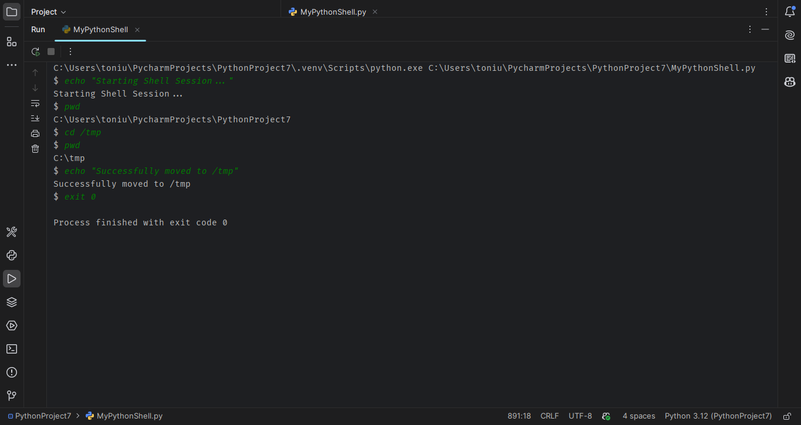
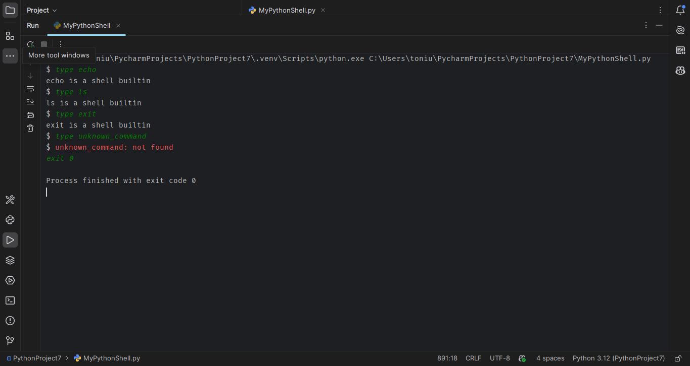
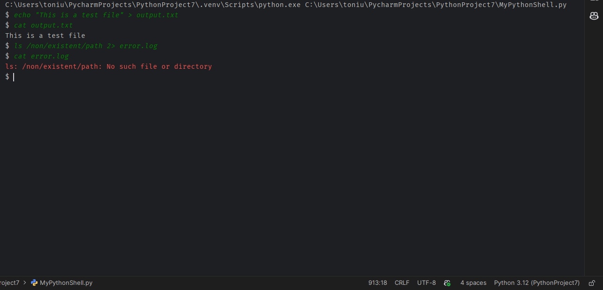
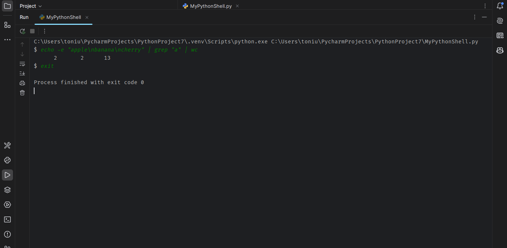
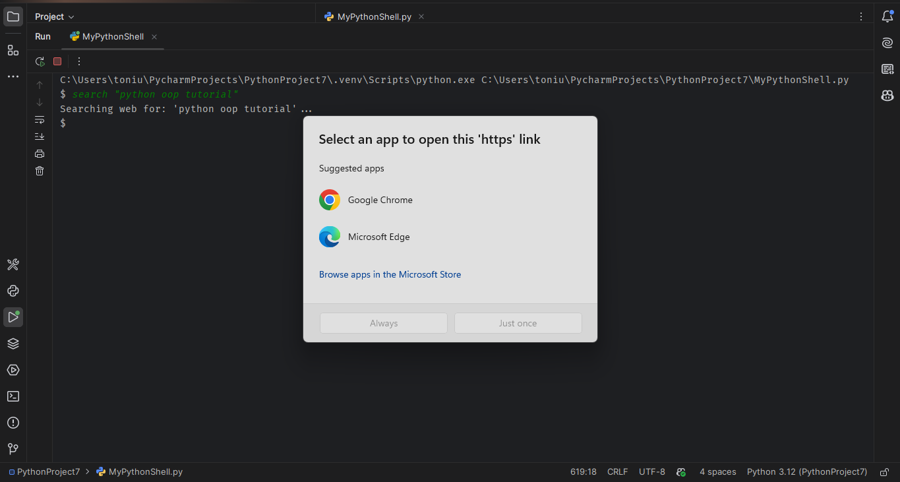
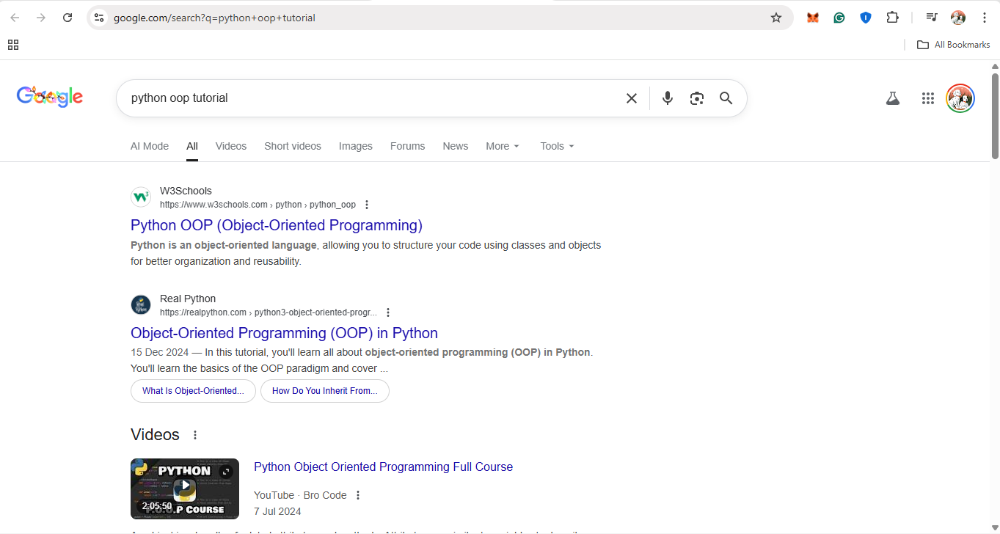

# MyPythonShell
# 🐚 Shell Usage & Visual Walkthrough

This document provides a detailed visual guide to the capabilities of the Python Shell.

---

## 1. Basic Navigation & Built-ins
The shell implements standard POSIX commands internally to ensure cross-platform compatibility (working on Windows without requiring WSL).

**Key Commands:**
- `pwd`: Print Working Directory.
- `cd <path>`: Change Directory (supports `~` for home).
- `echo <text>`: Print text to stdout.

**Visual Demo:**
> *Screenshot shows startup, verifying current directory, changing to `/tmp`, and printing a success message.*

---

## 2. Command Type Inspection
The `type` command is critical for understanding how the shell interprets inputs. It distinguishes between:
1.  **Shell Built-ins**: Functions defined within `shell.py` (e.g., `cd`, `history`).
2.  **External Executables**: Binaries found in the system `$PATH` (e.g., `git`, `python`).
3.  **Unknown Commands**: Returns a specific error message.

**Visual Demo:**
> *Screenshot shows `type` identifying built-ins vs. external paths and handling missing commands in red.*

---

## 3. Input/Output Redirection
The shell manually manages file descriptors to redirect streams, allowing users to save command output to files or capture errors separately.

**Supported Operators:**
- `>`: Overwrite standard output to a file.
- `>>`: Append standard output to a file.
- `2>`: Redirect standard error to a file.

**Visual Demo:**
> *Screenshot shows creating a file via echo, reading it back with cat, and capturing a "file not found" error log.*

---

## 4. Multi-Stage Pipelines
This is the most complex feature. The shell chains multiple processes together, connecting the `stdout` of one command to the `stdin` of the next. On Windows, this is achieved using `subprocess` and temporary files/pipes, avoiding Unix-specific `fork()` calls.

**Example Command:**
echo -e "apple\nbanana\ncherry" | grep "a" | wc -l
**Visual Demo:**

> *Screenshot shows the shell processing data through three distinct stages to calculate a final count.*

## 5. History Management

The shell persists command history to a file (defined by `HISTFILE`) so sessions are not lost.

**Features:**

* `history`: List all commands with indices.

* `history -w <file>`: Write current session to a specific file.

* `history -a <file>`: Append new commands to a specific file.

* `history -r <file>`: Read history from a specific file.

**Visual Demo:**

> *Screenshot shows listing history, writing it to a file, and verifying the file content.*

## 6. Automation: Web Search

To demonstrate extensibility, a custom `search` command was added. This allows users to Google search directly from the terminal, triggering the OS's default web browser.

**Command:**

search "python oop tutorial"

**Visual Demo (Terminal):**

> *Screenshot shows the shell parsing the query and triggering the browser.*

**Visual Demo (Browser):**

> *Screenshot shows the resulting Google Search page opening.*

